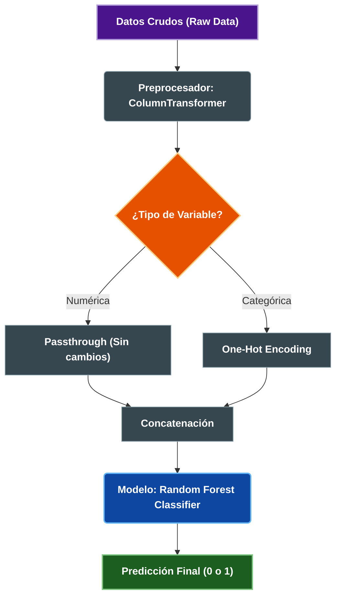

# 📉 Predicción de Churn en Telecomunicaciones


> **Resumen:** Solución End-to-End de Machine Learning para predecir la fuga de clientes (Churn) en una empresa de telecomunicaciones. Incluye limpieza de datos, análisis exploratorio, modelado con Random Forest y un Pipeline automatizado listo para producción.

---

## 📖 Contexto del Proyecto
La pérdida de clientes (Churn) es uno de los desafíos más costosos en la industria de las telecomunicaciones. Este proyecto analiza datos históricos para:
1.  **Entender:** ¿Por qué se van los clientes?
2.  **Predecir:** ¿Qué clientes tienen alta probabilidad de irse el próximo mes?
3.  **Actuar:** Diseñar estrategias de retención basadas en datos.

---

## 📂 Diccionario de Datos
El modelo fue entrenado utilizando un dataset consolidado con las siguientes variables clave:

| Variable | Tipo | Descripción | Ejemplo |
| :--- | :--- | :--- | :--- |
| `customer_id` | Texto | ID único del cliente (No utilizado en predicción) | `7590-VHVEG` |
| `tenure` | Numérico | Meses que el cliente ha permanecido en la empresa | `12`, `24` |
| `monthly_charges` | Numérico | Monto mensual facturado | `29.85` |
| `total_charges` | Numérico | Monto total facturado histórico | `1889.50` |
| `contract_type` | Categórico | Tipo de contrato (Factor crítico) | `Month-to-month`, `Two year` |
| `payment_method` | Categórico | Medio de pago utilizado | `Electronic check`, `Credit card` |
| `internet_service` | Categórico | Tipo de servicio de internet | `Fiber optic`, `DSL`, `No` |
| `churn` | Target | **Variable Objetivo:** ¿El cliente canceló? | `0` (No), `1` (Sí) |

---

## 🛠️ Tecnologías y Herramientas
* **Lenguaje:** Python
* **ETL & Análisis:** Pandas, NumPy
* **Visualización:** Seaborn, Matplotlib
* **Machine Learning:** Scikit-Learn (Random Forest, Pipeline, ColumnTransformer)
* **Control de Versiones:** Git/GitHub

---

## ⚙️ Arquitectura del Proyecto

El desarrollo se estructuró en 4 fases principales:

1.  **Ingeniería de Datos (ETL):** Limpieza de nulos, tratamiento de duplicados y transformación de tipos.
2.  **EDA (Análisis Exploratorio):** Detección de patrones y correlaciones.
3.  **Modelado:** Entrenamiento y validación de algoritmos.
4.  **Deployment:** Creación de un Pipeline serializado.

### 🔄 Flujo del Pipeline (Model Workflow)
El siguiente diagrama ilustra cómo el artefacto `.joblib` procesa los datos automáticamente:


## 📊 Resultados e Insights de Negocio

El modelo **Random Forest** alcanzó un **Accuracy aproximado del 90%** en el set de prueba. Basado en la importancia de las variables (Feature Importance), se generaron las siguientes recomendaciones:

1.  **Alerta en Contratos Mensuales:** Los clientes con contrato "Month-to-month" son los más propensos a irse.
    * *Estrategia:* Ofrecer descuentos por migración a planes anuales.
2.  **Riesgo en Nuevos Clientes:** La tasa de cancelación es crítica en los primeros meses (`tenure` bajo).
    * *Estrategia:* Programa de "Onboarding VIP" durante los primeros 90 días.
3.  **Sensibilidad al Precio:** Usuarios con cargos altos sin servicios premium tienden a rotar.
    * *Estrategia:* Revisión de planes y oferta de beneficios exclusivos.

---

## 🚀 Cómo usar este proyecto

### 1. Clonar el repositorio
```bash
git clone [https://github.com/](https://github.com/)[TU-USUARIO]/[NOMBRE-REPO].git

### 2. Cargar el Modelo (Para integración en Backend)
El proyecto entrega un archivo `pipeline_churn_v1.joblib` que acepta datos crudos.

```python
import joblib
import pandas as pd

# Cargar el pipeline
modelo = joblib.load('models/pipeline_churn_v1.joblib')

# Ejemplo de cliente nuevo (Datos crudos como vienen de la web)
nuevo_cliente = pd.DataFrame([{
    'contract_type': 'Month-to-month',
    'monthly_charges': 70.5,
    'tenure': 2,
    'payment_method': 'Electronic check',
    # ... otras columnas requeridas
}])

# Predicción (0 = Se queda, 1 = Se va)
prediccion = modelo.predict(nuevo_cliente)
print(f"Predicción de Churn: {prediccion[0]}")
```

## 📂 Estructura de Archivos
```text
├── data/                # Dataset utilizado
├── notebooks/           # Notebook con el análisis completo (.ipynb)
├── models/              # Archivos .joblib listos para producción
├── README.md            # Documentación del proyecto
└── requirements.txt     # Librerías necesarias
```

---
*Proyecto realizado como parte del programa ONE (Oracle Next Education) - Alura Latam.*

# 📊 ChurnInsight - Predicción de Retención de Clientes

Una solución integral para analizar, predecir y reducir la tasa de abandono de clientes (Churn Rate) mediante Inteligencia Artificial, soportada por una arquitectura modular y escalable.

Este proyecto fue desarrollado con orgullo por **H12-25-L-Equipo 11-Data Science** como parte de la iniciativa One Oracle / Alura Latam y teniendo como medio la plataforma de simulación laboral No Country

## 👥 Equipo de Desarrollo

| Nombre                              | Especialización     | País | Horario        | Redes                                                                             |
| ----------------------------------- | ------------------- | ---- | -------------- | --------------------------------------------------------------------------------- |
| Miguel Buitrago                     | Data Scientist      | 🇨🇴   | UTC -5         | [LinkedIn](https://www.linkedin.com/) / [GitHub](https://github.com/MiguelonMigue)   |
| Franco Daniel Luvisotti Junco       | Backend Developer   | 🇦🇷   | 8 - 14 hs (UTC -3) | [LinkedIn](https://www.linkedin.com/) / [GitHub](https://github.com/FrancoLuvisotti) |
| Matias Fanucchi                     | Data Engineer       | 🇦🇷   | 8 - 12 hs (UTC -3) | [LinkedIn](https://www.linkedin.com/) / [GitHub](https://github.com/)             |
| Juan Eduardo Garcia Larrazabal      | Backend Developer   | 🇸🇻   | 8 - 12 hs (UTC -6) | [LinkedIn](https://www.linkedin.com/) / [GitHub](https://github.com/)             |
| Cristian Esteban Maida              | Backend Developer   | 🇦🇷   | 8 - 12 hs (UTC -3) | [LinkedIn](https://www.linkedin.com/) / [GitHub](https://github.com/CristianEstMaida) |
| Daisy Quinteros                     | Data Scientist      | 🇨🇱   | 8 - 12 hs (UTC -3) | [LinkedIn](https://www.linkedin.com/) / [GitHub](https://github.com/veterydaisy)     |
| Brian Exequiel Maciel               | Backend Developer   | 🇦🇷   | 8 - 12 hs (UTC -3) | [LinkedIn](https://www.linkedin.com/) / [GitHub](https://github.com/)             |
| Jose Luis Riveros                   | Backend Developer   | 🇨🇱   | -              | [LinkedIn](https://www.linkedin.com/)                                             |

---

## 📋 Distribución de Tareas y Responsables

| Área                    | Tarea                                 | Responsable                   |
| ----------------------- | ------------------------------------- | ----------------------------- |
| ☕ Java / Backend       | Test y PostgreSQL                     | Juan Eduardo                  |
| ☕ Java / Backend       | Crear Entidad                         | Miguel Buitrago               |
| ☕ Java / Backend       | Crear Service                         | Franco                        |
| ☕ Java / Backend       | Crear DTO                             | Jose Luis Riveros             |
| ☕ Java / Backend       | Crear Controller                      | Jose Luis Riveros             |
| ☕ Java / Backend       | Crear Repository                      | Brian Maciel                  |
| 🐍 Python / Integración | Carga del Modelo de Predicción        | Cristian Maida y Juan Eduardo |
| 🐍 Python / Integración | Captura de datos de JAVA              | Cristian Maida y Juan Eduardo |
| 🐍 Python / Integración | Manejo de errores                     | Cristian Maida y Juan Eduardo |
| 🧠 Data Science         | Modelo de predicción y entrenamiento  | Daisy Quinteros               |
| 🧠 Data Science         | Creación de un Pipeline serializado   | Daisy Quinteros               |
| 🎨 Frontend (Vaadin)    | Crear el Dashboard                    | Juan Eduardo                  |
| 🎨 Frontend (Vaadin)    | Crear el formulario de predicción     | Juan Eduardo                  |
| 🎨 Frontend (Vaadin)    | Crear los estilos personalizados      | Juan Eduardo                  |

---

## 🚀 Acerca del Proyecto

ChurnInsight divide su lógica en servicios especializados para ofrecer un rendimiento óptimo y una clara separación de responsabilidades entre el análisis de datos y la gestión de usuarios.

### Arquitectura del Sistema

1.  **churn-service (Python):** Microservicio encargado de la limpieza de datos, entrenamiento y ejecución de modelos de Machine Learning (IA).
2.  **app (Backend Java):** Núcleo de la aplicación (Spring Boot), gestión de lógica de negocio, seguridad y orquestación de datos.
3.  **frontend (Vaadin):** Interfaz visual web para que los usuarios finales interactúen con el sistema y vean los dashboards.
4.  **Base de Datos (PostgreSQL):** Almacenamiento persistente de datos históricos, usuarios y resultados de predicciones.

### 📂 Estructura del Repositorio

El proyecto está organizado en módulos independientes dentro del mismo repositorio ("Monorepo"):

```
repo_DataScience/
├── app/                  # NÚCLEO: Backend con Java Spring Boot y UI con Vaadin
│   └── src/              # Código fuente de la aplicación Java
├── churn-service/        # INTELIGENCIA: Servicio de Python para predicciones
│   ├── app.py            # API para la inferencia del modelo de IA
│   └── *.joblib          # Modelo de IA entrenado
├── frontend/             # VISUAL: Interfaz de usuario moderna con React
│   ├── src/              # Código fuente de la aplicación React
├── .vscode/              # Configuración para desarrolladores (VS Code)
├── .gitignore            # Archivos que Git debe ignorar
└── README.md             # Documentación oficial del proyecto
```

---

## ⚙️ Guía de Instalación para Principiantes

Si es tu primera vez ejecutando este proyecto, sigue estos pasos estrictamente en orden.

### Paso 0: Prerrequisitos

Asegúrate de tener instalado el siguiente software:
*   Java JDK 17+: [Descargar Oracle JDK](https://www.oracle.com/java/technologies/downloads/).
*   Python 3.8+: [Descargar Python](https://www.python.org/downloads/) (Marcar casilla "Add to PATH").
*   PostgreSQL: [Descargar PostgreSQL](https://www.postgresql.org/download/).
*   Git: [Descargar Git SCM](https://git-scm.com/downloads).
*   Maven: (Generalmente incluido en IDEs como IntelliJ o VS Code, sino [descargar Apache Maven](https://maven.apache.org/download.cgi)).

### Paso 1: Descargar el Proyecto Completo

Abre una terminal (PowerShell o CMD) en la carpeta donde trabajarás:

```sh
git clone https://github.com/Gott95/repo_DataScience.git
cd repo_DataScience
```

### Paso 2: Preparar la Base de Datos

El proyecto necesita una base de datos activa para arrancar.

1.  Abre pgAdmin 4 (o tu cliente SQL preferido).
2.  Crea una nueva base de datos llamada `churn_insight_db`:
    ```sql
    CREATE DATABASE churn_insight_db;
    ```
3.  Configura las credenciales en el archivo `app/src/main/resources/application.properties`:
    ```properties
    spring.datasource.url=jdbc:postgresql://localhost:5432/churn_insight_db
    spring.datasource.username=postgres  # <-- Tu usuario
    spring.datasource.password=1234      # <-- Tu contraseña
    ```

### Paso 3: Activar el Servicio de IA (Python)

Este módulo debe estar listo para recibir peticiones de análisis.

1.  Abre la terminal dentro de la carpeta `churn-service`:
    ```sh
    cd churn-service
    ```
2.  Crea y activa un entorno virtual:
    ```sh
    # Windows
    python -m venv venv
    .\venv\Scripts\Activate
    ```
3.  Instala las dependencias:
    ```sh
    pip install -r requirements.txt
    ```

### Paso 4: Iniciar la Aplicación Principal (Java)

1.  Abre una nueva terminal y entra a la carpeta `app`:
    ```sh
    cd app
    ```
2.  Ejecuta el proyecto con Maven:
    ```sh
    mvn spring-boot:run
    ```

🚀 ¡Listo! Abre tu navegador y ve a: http://localhost:8080

---

## 🤝 Cómo Contribuir (Gitflow Simplificado)

Para mantener el código ordenado, seguimos este flujo de trabajo:

1.  **Actualiza tu repo local:**
    ```sh
    git checkout main
    git pull origin main
    ```
2.  **Crea una rama para tu tarea:** Usa nombres descriptivos como `feature/nueva-vista` o `fix/error-login`.
    ```sh
    git checkout -b feature/nombre-de-tu-cambio
    ```
3.  **Guarda tus cambios:**
    ```sh
    git add .
    git commit -m "Descripción clara de lo que hiciste"
    ```
4.  **Sube tus cambios a GitHub:**
    ```sh
    git push origin feature/nombre-de-tu-cambio
    ```
5.  **Solicita revisión:** Ve a GitHub y abre un Pull Request hacia la rama `main`.

---

## 🆘 Solución de Problemas Comunes

*   **Error "Port 8080 is already in use":**
    *   Significa que ya tienes la app corriendo. Cierra otras terminales o detén el proceso Java.
*   **Error de conexión JDBC:**
    *   Verifica que el servicio de PostgreSQL esté corriendo (Servicios de Windows > `postgresql-x64`).
    *   Verifica usuario y contraseña en `application.properties`.
*   **Python "pip no reconocido":**
    *   Asegúrate de haber reiniciado tu terminal después de instalar Python.
